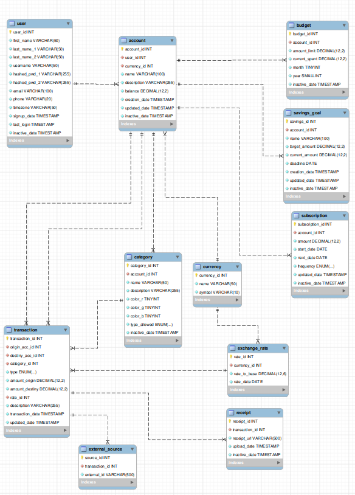

### FLUJEX


Proyecto del curso **IC-4301 Bases de Datos 1** del ITCR. Primer semestre de 2026.

---

#### Descripción

**Flujex** es una aplicación de manejo de finanzas en la cuál el usuario puede: 

 - Abrir diversas cuentas de dinero.
 - Realizar transacciones, incluso entre cuentas de distintas monedas.
 - Registrar gastos e ingresos.
 - Clasificar movimientos de ahorros en categorías personalizadas.
 - Establecer metas de ahorro.
 - Dictar presupuestos.
 - Registrar suscripciones y pagos automáticos periódicos.
 - Observar un dashboard con un resúmen de las finanzas de sus cuentas.

---

#### Estructura

- **AppBackend/:** python3.
- **AppFrontend/:** react+vite.
- **DB/:** diagrama de la base de datos y script SQL de creación.
- **Docs/:** especificación del proyecto y otros documentos.

---

#### Base de datos

Base de datos desarrollada en MySQL y normalizada hasta 3FN.



---

#### Instalación

**Requisitos:**
- Python 3.12+
- Node.js (LTS) y npm
- MySQL Server

&nbsp;

**1. Configuración del backend:**

```bash
cd AppBackend

# Crear entorno virtual de python
python3 -m venv venv

# Activar el entorno
source venv/bin/activate

# Instalar dependencias
pip install flask flask-cors mysql-connector-python python-dotenv

# Para ejecutar el backend
python3 main.py
```

&nbsp;

**2. Configuración del frontend:**

```bash
cd AppFrontend
npm install

# Para ejecutar el frontend
npm run dev
```

